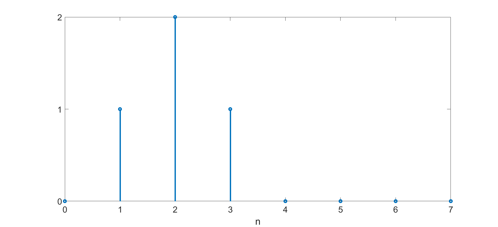
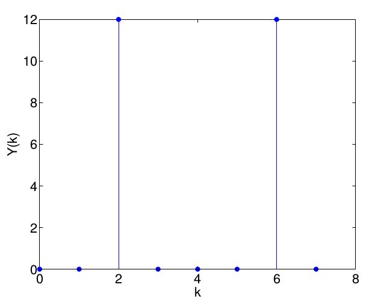

# Guía 3 - Transformada discreta de Fourier

1.  Dada la siguiente señal $x[n]$ de 8 muestras, calcular su DFT.

    

    Escribir un algoritmo que calcule la DFT utilizando alguna función del tipo FFT.

1.  Dada la señal $y[n]$, calcular la DFT de 16 muestras. Además graficar la magnitud, la fase, parte real y la parte imaginaria de la trasnformada.

    $$y[n] = 2 sen \left(\frac{2\pi n}{8}\right)$$

1.  Dada la señal $y[n]$ de 32 muestras:

    $$y[n] = 3 - e^{-j\pi n / 4}+ e^{j\pi n/4}$$

    1.  Escriba su transformada discreta de Fourier $Y[k]$ utilizando el total de las muestras (No es necesario que se resuelva la sumatoria en función de $n$).
    1.  Inspeccionando $Y[k]$, ¿para qué valores de $k$ la respuesta en módulo de $Y[k]$ será no nula?¿Por qué? ¿Puede estimar qué magnitud tendrá $Y[k]$ para estos valores?
    1.  Desarrolle un código para evaluar la función $Y[k]$ determinada en el punto a). Utilizando la función _stem_, realice dos gráficos en una única figura con el módulo y la fase de $Y[k]$. ¿Coinciden los resultados encontrados con lo que predijo en el punto b)?.

1.  Dada la siguiente señal discreta:

    $$x[n] = e^{-j\pi n/3}$$

    1.  Calcular la DTFT de dicha señal.
    1.  Calcular ahora la DFT de $N$ muestras.
    1.  Evalúe analíticamente el impacto de la selección de $N$ en la respuesta en frecuencia. ¿Cómo y qué número de muestras elegiría?
    1.  Desarrolle un código para evaluar sus respuestas en los puntos b) y c). El algoritmo debe poseer una $x_1[n]$ y una $x_2[n]$, así como sus respectivas transformadas $X_1[k]$ (\textit{sin leaking}) y $X_2[k]$ (\textit{con leaking}). Realizar en una misma figura al menos un gráfico para cada una de las 4 funciones para comparar el efecto de la elección de $N$.

1.  Dado el siguiente gráfico del módulo de la DFT de una señal real _sin leaking_ $Y[k]$, encuentre la función temporal que le dio origen. Asuma que la fase es nula.

    

1.  Representar gráficamente toda la información (componentes real, imaginario y fase) de la DFT de 16 muestras de la siguiente señal:

    $$ y[n] = -1 + sin \left(\frac{\pi}{4}n\right) - cos \left(\frac{\pi}{2}n\right) $$

1.  Dadas las 4 señales temporales discretas $y_i[n]$ de 64 muestras que se definen a continuación:

    $$ y_1[n] = u[n] \hspace{36pt} Y_1[k] = \begin{cases}\dfrac{N}{2} & k = 0 \hspace{6pt} y \hspace{6pt} k = 63\\ 0 & otro\hspace{6pt}caso \end{cases} $$

    $$ y_2[n] = \dfrac{1}{2}sen \left(\dfrac{2\pi}{4}n\right) u[n] \hspace{36pt} Y_2[k] = \begin{cases}\dfrac{N}{8}i & k = 8\\-\dfrac{N}{8}i & k = 56\\ 0 & otro\hspace{6pt}caso \end{cases} $$

    $$ y_3[n] = 2cos\left(\dfrac{2\pi}{8}n\right)u[n] \hspace{36pt} Y_3[k] = \begin{cases}N & k = 8 \hspace{6pt} y \hspace{6pt} k = 56\\ 0 & otro\hspace{6pt}caso \end{cases} $$

    $$ y_4[n] = cos\left(\dfrac{2\pi}{12}n\right)u[n] \hspace{36pt} Y_4[k] = \begin{cases}\dfrac{N}{2} & k = 12 \hspace{6pt} y \hspace{6pt} k = 52\\ 0 & otro\hspace{6pt}caso \end{cases} $$

    1.  Sin realizar ningún cálculo, evalúe en cada caso si las $Y_i[k]$ provistas efectivamente corresponden a la DFT de cada función $y_i[n]$. Para esto, halle las frecuencias características de cada señal. ¿Cómo interactúan éstas con la cantidad de muestras que se evalúen?
    1.  Desarrolle un código para graficar cada función junto con su transformada. Es importante que logre centrar las respuestas en frecuencias en 0. De esta manera, debería ser posible identificar los valores de $k$ que corresponden a frecuencias negativas y aquellos que corresponden a frecuencias positivas.

1.  En este ejercicio, se busca evaluar el efecto de un desplazamiento temporal en el valor de la DFT. Calcule la transformada de la señal $x[n]$ de 16 muestras:
    $$ x[n] = \delta [n] $$

    1.  La transformada del delta es conocida; de todas formas grafíquela utilizando algún software. Para este ejercicio es de interés analizar la magnitud, la parte real y la fase de la DFT.
    
    Realice un desplazamiento temporal de la señal. Analice la nueva señal desplazada $x_1[n]$:

    $$ x_1[n] = \delta [n-1] $$

    1.  Realice el mismo gráfico del punto anterior. ¿Qué puede decir sobre la nueva DFT?

    Escriba en papel las dos transformadas. ¿En qué se diferencian? Puede realizar un nuevo desplazamiento temporal para ayudarse. Intente deducir cómo se refleja el desplazamiento temporal en el dominio de la frecuencia.

1.  Dadas dos secuencias discretas de cuatro puntos $x[n]$ y $h[n]$:

    $$ x[n] = cos\left(\dfrac{\pi n}{2}\right) \hspace{36pt} h[n] = 2^n $$

    1.  Calcular la DFT $X[k]$ de cuatro puntos de $x[n]$, y graficar su módulo.
    1.  Calcular la DFT $H[k]$ de cuatro puntos de $h[n]$, y graficar su módulo.
    1.  Calcular la convolución circular de $x[n]$ y $h[n]$.
    1.  Desarrolle un algoritmo para realizar los cálculos de los puntos a), b) y c), y muestre gráficamente los resultados (módulo de $X[k]$, módulo de $H[k]$ y el resultado de la convolución circular).

1.  Para las siguientes señales discretas finitas de $N = 64$ muestras, determinar:

    1.  La magnitud y la fase de la DFT de la señal $x_1[n] = sen \left(\dfrac{5}{16}\pi n\right) -1$. ¿Existe el efecto de leaking?.
    1.  El valor de la frecuencia de la señal $x_2[n] = 2 cos \left(\dfrac{5}{64}\pi n\right)$. ¿Existe el efecto de leaking?
    1.  El valor **exacto** de la magnitud de la DFT de la señal del punto anterior, $|X[k]|$, solamente para las muestras $k = 2$ y $k = 3$.

    ??? info "Nota"
        La transformada de una ventana rectangular de N muestras (0...N-1) es:

        $$ V[k]= e^{-j\pi k \left(\frac{N-1}{N}\right)} \frac{sen(\pi k)}{sen\left(\dfrac{\pi}{N}k\right)} $$

1.  Dadas las siguientes señales, de longitud $N = 20$:

    $$ y_1[n] = 0.5u[n] + cos \left(\dfrac{3\pi}{12}n\right) $$

    $$ y_2[n] = cos \left(\dfrac{3\pi}{32}n\right) $$

    $$ y_3[n] = cos \left(\dfrac{3\pi}{16}n\right) + sin \left (\dfrac{7\pi}{12}n\right) $$

    1.  Graficar la magnitud de la DFT de cada una de las señales.
    1.  ¿Qué señales presentan leaking y cuáles no? ¿A qué se debe?

