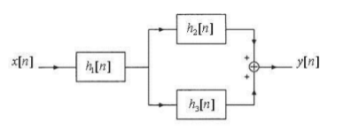

#Guía 1 - Señales y sistemas discretos

1.  Determine si las siguientes señales son señales de energía, señales de potencia o ninguna de las dos. Para una señal discreta $x[n]$:

    _Energía_:

      $E =  \sum_{k=-\infty}^{\infty} |x[k]|^2$

    _Potencia_:

      $P = \lim_{N \to \infty} \frac{1}{2N+1} \sum_{k=-N}^{N} |x[k]|^2$

    1. $x[n] = (-0.5)^{n} u[n]$
    1. $x[n] = u[n]$
    1. $x[n] = 2e^{j3n}$

1.  Dada una señal discreta $x[n]$ y su extensión periódica $y[n] = x[n+7k]$ con $k$ entero,

    $x(n) =
  \begin{cases}
    (-1)^{n}       & \quad \text{} n \text{= 1, 2, 3}\\
    0  & \quad \text{} \text{resto}
  \end{cases}$

    Calcular la energía y la potencia de las señales $x[n]$ e $y[n]$.

1.  Determine cuál de las siguientes señales es periódica. Si la señal es periódica determine su período fundamental.

    1.  $x[n] = e^{j(\pi/4)n}$
    1.  $x[n] = cos \left(\frac{\pi}{3}n\right) + sen \left(\frac{\pi}{4}n\right)$
    1.  $x[n] = cos \left(\frac{n}{4}\right)$
    1.  $x[n] = cos^2 \left(\frac{\pi}{8}n\right)$

1.  Verificar que las siguientes funciones discretas exponenciales complejas $s_k[n]= e^{j(2\pi/N)kn}$ y $s_l[n]= e^{j(2\pi/N)ln}$ son funciones ortogonales entre sí (Ver diapositivas de clase 1). Además, verificar numéricamente para señales de longitud $N=4$ con $k=2$ y $l=4$.

1.  Utilizando las señales exponenciales complejas del Ejercicio 4, calcular el producto interno $<s_k, s_k>$.

1.  Calcular la respuesta del sistema con entrada $x[n]$ y respuesta al impulso $h[n]$.

    $x[n] = 0.5n (u[n] - u[n-6])$
	  
    $h[n] = 2sen\left(\frac{n\pi}{2}\right)(u[n+3] - u[n-4])$

1.  Se define a $s[n]$ como la respuesta al escalón $x[n] = u[n]$ en un sistema LIT. A partir de $s[n]$ encontrar la respuesta a la muestra unitaria $h[n]$ del sistema. Como caso particular calcule $h[n]$ para:

    $$s[n] = n(0.5)^{n} u[n]$$

1.  Dado el siguiente sistema, con $h_1[n]=u [n-2],h_2[n]=nu[n]$ y $h_3[n]=\delta[n-2]$, encontrar la
respuesta al impulso discreto de todo el sistema.

    

1.  _Para resolver con algún lenguaje de programación_.
    
    1.  Dadas dos señales de longitud finita $x [n] \hspace{12pt} n_{xi}\le n\le n_{xd}$ y $h [n] \hspace{12pt} n_{hi}\le n\le n_{hd}$, la longitud de la respuesta $y[n]= x [n] \ast h[n]$ tiene un valor distinto de cero entre $n_{yi}\le n\le n_{yd}$, siendo:

    $$ n_{yi}= n_ {xi} + n_{hi} $$

    $$ n_{yd}= n_{xd}+ n_{hd} $$

       En base a esta información construir una función que acepte como entrada las señales $x[n]$ y $h[n]$ con sus respectivas longitudes, y que como salida se obtenga la respuesta $y[n]$ con su correspondiente rango de tiempo.
    
    1.  Construir una función que tenga la misma respuesta $y[n]$ como salida, a partir de la implementación de la _Convolución Circular_. 

    ??? info "Nota"
        Ver condición de equivalencia entre convolución lineal y convolución circular.

    1.  Utilizando las funciones creadas previamente, realizar una evaluación de los algoritmos a partir de convolucionar una señal de audio cualquiera con una respuesta al impulso determinada.

    ??? info "Nota"
        Es posible descargar de manera libre y gratuita diversas respuestas al impulso de una gran variedad de recintos desde la página http://www.openairlib.net en la sección IR Data.

1.  Sean $y_1 = \{2, -5, 2_{n=0},-3, -2\}, y_2 = \{2, -5, 0_{n=0},1,0\}, y_3 = \{-1, 1_{n=0},3, 1\}$ respectivamente las respuestas de un sistema LIT $x_1 = \{-2, 1_{n=0},-2\}$, $x_2 = \{-2, 1_{n=0},0\}$ y $x_3 = \{1_{n=0}, 1\}$. Encontrar la respuesta al impulso de dicho sistema.

1.  Determine la autocorrelación normalizada de las siguientes señales.

    $$x[n] = \{1_{n=0},2,1,1\}$$

    $$y[n] = \{1_{n=0},1,2,1\}$$

    $$x[n] = 
    \begin{cases}
    1       & \quad \text{-N}\le n \le \text{N}\\
    0 		 & \quad \text{} \text{en otro caso}
    \end{cases}$$

1.  Hallar la correlación entre las siguientes secuencias:

    $$x[n] = u[n] - u[n-6]$$

    $$h[n] = u[n-2] - u[n-5]$$

1.  Hallar la autocorrelación de la señal $x[n]$.

    $$x[n] = \alpha^{n} u[n] \hspace{48pt} |\alpha| < 1$$

1.  La estimación de tiempo en señales de radar siendo $x_a(t)$ la señal transmitida y la señal $y_a(t)$ recibida se calcula como: $y_a(t) = a x_a(t- t_d)+ v_a(t)$ , siendo $v_a(t)$ un ruido aditivo.

    Las señales $x_a(t)$ e $y_a(t)$ se muestran en el receptor de acuerdo con el _teorema de muestreo_ y se procesan digitalmente para determinar el retardo de tiempo y, por tanto, la distancia del objeto. Las señales discretas en el tiempo resultantes son:

    $$x[n] = x_a (nT)$$

    $$y[n] = y_a (nT) = ax_a(nT - DT) + v_a(nT) = ax[n - D] + v[n]$$

    Explique cómo mediría el retardo $D$ calculando la correlación cruzada $r_{xy}[l]$.

1.  Encontrar la respuesta de un sistema LIT ante una entrada $x[n] = e^{j\omega n}$ definiendo como respuesta en frecuencia a la expresión:

    $$y[n] = x[n-n_r]$$

**Asegúrese de recordar cómo se calculan raíces de números complejos.**

_Expresiones útiles:_

$$\sum_{n=0}^{N-1} a^n = \frac{1-a^N}{1-a}$$

$$\sum_{n=0}^{\infty} a^n = \frac{1}{1-a} \hspace{24pt} |a|<1$$

$$\sum_{n=0}^{N-1} na^n = \frac{(N-1)a^{N+1}-Na^N+a}{(1-a)^2}$$

$$\sum_{n=0}^{N-1} n = \frac{1}{2}N(N-1)$$

$$\sum_{n=0}^{\infty} na^n = \frac{a}{(1-a)^2} \hspace{24pt} |a|<1$$

$$\sum_{n=0}^{N-1} n^2 = \frac{1}{6}N(N-1)(2N-1)$$
