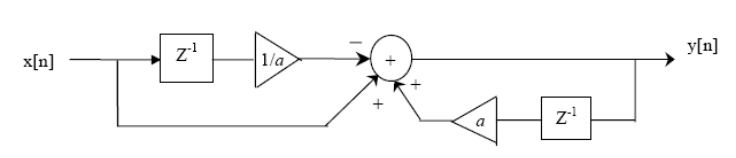
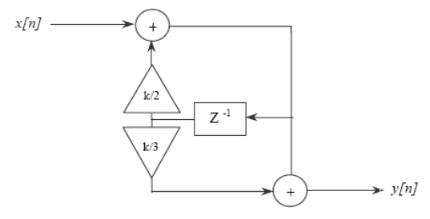
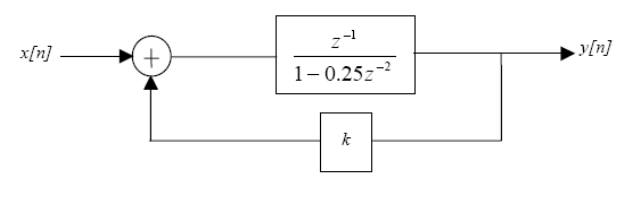

# Guía 5 - Transformada Z (sistemas)

1.  Dado el siguiente sistema LIT discreto y causal, se pide:

    

    1.  Demuestre que el sistema es estable.
    1.  Calcule la respuesta al impulso del mismo.
    1.  Calcule la secuencia de salida $y[n]$ siendo $x[n] = u[n]$.

1.  El siguiente es un sistema lineal, invariante y causal. Se pide:

    

    1.  Determine la región de convergencia de $H(z)$ y grafique su diagrama de polos y ceros.
    1.  ¿Para qué rango de valores de $a$ el sistema es estable?
    1.  Muestre que el sistema es un pasa todo, es decir que la respuesta en frecuencia del sistema es constante.

1.  Considere el sistema discreto que se muestra a continuación. Se pide:

  
    

    1.  ¿Para qué valores de $k$ el sistema es estable?
    1.  Si la señal de entrada es $x[n] = (0.5)^{n}u[n]$ , calcule la señal de salida $y[n]$,considerando $k=1/2$.

1.  Para que el sistema de la siguiente figura sea estable, se debe cumplir que $z<1$. Calcule los valores posibles de la constante $k$:

    

1.  Considere un sistema LIT con la siguiente función de transferencia:

    $$ H(z) = \dfrac{z^{-1}-\alpha^*}{1-\alpha z^{-1}} \hspace{36pt} |\alpha|<1 $$

    1.  Encontrar la ecuación en diferencias para implementar el sistema.
    1.  Mostrar que este sistema se comporta como un “pasa todo” (un sistema para el cual su magnitud es constante para todas las frecuencias).
    1.  La función $H(z)$ se pone en cascada con otra función $G(z)$ de tal manera que la función de transferencia total del sistema sea la unidad. Si $G(z)$ resultara estable, encontrar la respuesta en muestras $g[n]$.

1.  Una secuencia $x[n]$ de fase **NO** mínima tiene como transformada Z:

    $$ X(z) = \dfrac{\left(1-\dfrac{3}{2}z^{-1}\right)\left(1+\dfrac{1}{3}z^{-1}\right)\left(1+\dfrac{5}{3}z^{-1}\right)}{\left(1-z^{-1}\right)^2 \left(1-\dfrac{1}{4}z^{-1}\right)}  $$

    ¿Para qué valores de la constante $\alpha$, tendrá la secuencia $y[n]= \alpha^{n} x[n]$ fase mínima?

1.  Dado el siguiente sistema en bloques LIT causal, determinar:

    

    1.  La función transferencia del sistema $H(z)$.
    1.  Los valores del parámetro $k$ para que el sistema sea estable.
    1.  Para un valor de $k = 1/3$, determinar los polos y ceros de la función transferencia y la respuesta al impulso unidad $h[n]$.

1.  Dado el siguiente sistema en bloques LIT causal, determinar:

    

    1.  La función transferencia del sistema $H(z)$.
    1.  Ubicar los polos y ceros para $a_1 = 1/4, b_1 = 5/4$ y $b_2 = -3/8$. ¿Es estable? Justificar.
    1.  Con los valores anteriores, encontrar la respuesta al impulso $h[n]$.
    1.  Calcular la respuesta en frecuencia para $\omega = 0$ y $\omega = \pi$. ¿Qué tipo de respuesta en frecuencia (Pasa-bajo, Pasa-alto, Pasa-banda, etc) representa?.

    ??? info "Nota"
        $a_1$, $b_1$ y $b_2$ son constantes de ganancia.

1.  El sistema de la figura representa un generador digital de señales periódicas. Encontrar:

    

    

    1.  La función transferencia del sistema $H(z)$.
    1.  La función $P(z)$ y su respuesta en frecuencia para $\omega = 0$ y  $\omega = \pi$. Para esto, utilizar $b_0 = 0, b_1 = 1, b_2 = 2, b_3 = 3$.
    1.  La respuesta al impulso completa del sistema $h[n]$. Representar la misma temporalmente en dos períodos.

    ??? info "Ayuda"
        Utilizar la expansión en serie geométrica.

1.  Escriba un programa que grafique la magnitud, la fase y el retardo de grupo en los ejercicios anteriores.
