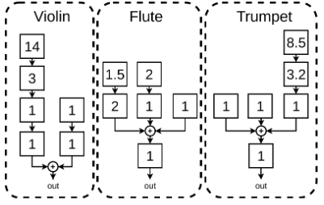

# Generación de audio de violín mediante síntesis FM y técnicas de procesamiento de señales diferenciable

## Breve introducción a la síntesis FM

La síntesis FM es una técnica de generación de audio surgida en la década de los 60's basada, como su nombre lo indica, en técnicas de modulación en frecuencia. A grandes rasgos, esta técnica está basada en dos grandes bloques: un oscilador que funciona como modulador, y un segundo oscilador que funciona como señal portadora. La idea del método consiste en que la frecuencia instantánea de la señal portadora es modificada según la amplitud de la señal modulante, como se puede ver en la figura:

En frecuencia, dependiendo de cómo sea la relación entre los períodos de las dos señales con las que estamos operando, los armónicos generados respetarán, valga la redundancia, una relación armónica. Si en cambio los períodos de las señales propuestas no cumplen esta proporción, se generarán sonidos inarmonicos, lo cual permite la síntesis de sonidos percusivos.

Información más detallada sobre el método está disponible en las referencias [1] y [2] (capítulo sobre síntesis FM únicamente).

## Breve introducción a redes neuronales artificiales

Una red neuronal es, a grandes rasgos, un sistema compuesto por distintos bloques, llamados neuronas. Estas neuronas están compuestas por una serie de parámetros (los coloquialmente llamados *pesos* de la red) y una función no lineal, que se llama función de activación. Las neuronas se conectan entre sí, en muchos casos variando la dimensión de los datos sobre los que operan (un vector de 100 muestras se puede reducir a uno de 50, por ejemplo). Lo interesante de modelos de este tipo es su capacidad de adaptarse a cuerpos de datos propuestos por el usuario, con el objetivo de cumplir una tarea determinada. Esto se logra buscando la minimización de una función, que llamaremos función de costo. Podemos pensar a esta última como un error que hay que minimizar, lo cual implica que nuestro modelo está *aprendiendo* satisfactoriamente la tarea que le propusimos. Un ejemplo muy sencillo de una red neuronal se puede ver en la siguiente figura:

La idea detrás del *entrenamiento* de un modelo de este tipo es, contrario a lo que uno podría esperar, bastante sencilla. Supongamos que tenemos un modelo $f$ con un conjunto de parámetros $\gamma$. Ante una entrada $x$, tendremos una salida del modelo $y_1$ o $f(x|\gamma)$ (permitan el abuso de notación), es decir, la salida del modelo $f$ con un conjunto de parámetros $\gamma$ dada una entrada en particular $x$. Mediante este proceso logramos que nuestro modelo haga *predicciones* basadas en algún dato de entrada, el tema es ¿cómo sabemos si esa predicción es correcta? Es en este punto en donde entra la función de costo, que llamaremos $g(y,\hat{y})$. La idea de esta etapa es cuantificar qué tanto se desvió la predicción del modelo ($\hat{y}$) del resultado que verdaderamente esperamos($y$). Acá hay que hacer una pausa para hacer un par de aclaraciones importantes:

  - Durante la etapa de entrenamiento la información sobre lo que debería entregar un modelo dada una entrada determinada es conocida.
  - Esto es cierto si trabajamos con sistemas bajo el paradigma de aprendizaje *supervisado*, no se cumple (o al menos no de esta forma) en otros paradigmas usuales en aprendizaje automático, como aprendizaje no supervisado o aprendizaje por refuerzo.

Retomando donde estábamos, la función de costo nos permite cuantificar el *error* en la predicción de este modelo. Esta función no es fija, se elige de acuerdo al tipo de problema con el que estamos trabajando, sin embargo hay algunos ejemplos bastante clásicos que podemos mencionar:

  - En problemas de regresión, métricas de distancia como el error cuadrático medio o su raíz son bastante usuales.
  - En problemas de clasificación es común trabajar con la idea de entropía cruzada, una noción que permite analizar la información entre instancias para lograr separar correctamente los distintos grupos de interés.
  - Muchas veces al trabajar con audio se definen métricas que tienen en cuenta nociones perceptuales; como se imaginarán este trabajo no va a ser la excepción.

Una vez que tenemos clara cuál es la función de costo que queremos optimizar surge otra pregunta interesante, ¿qué hacemos con esta información? Al estudiar el error de  las predicciones sobre las distintas instancias de nuestro cuerpo de datos de entrenamiento ganamos una noción de qué tan lejos está nuestro modelo de cumplir con la tarea para la cual lo estamos entrenando, o, en realidad, de minimizar la función que propusimos. Esta salvedad es importante, porque si elegimos mal la función a optimizar podemos obtener errores bajísimos y el modelo puede ser pésimo para cumplir la tarea que nos interesa. Entonces, retomando, si al estudiar el valor de la función de costo sobre nuestros datos encontramos que esta es elevada, significa que el conjunto de parámetros $\gamma$ de nuestro modelo no es correcto y necesita ser modificado para lograr el objetivo propuesto. Esto dispara otra pregunta ¿cómo acualizo los parámetros del modelo? Mediante un algoritmo conocido como propagación hacia atrás (usualmente conocido como *backpropagation*, en inglés). Es, en pocas palabras, una implementación muy eficiente de la regla de la cadena, que permite propagar los errores en la predicción sobre todo el modelo, buscando a partir de esos gradientes llegar a un mínimo de la función de costos propuesta. Una vez que se propagó el error y se modificaron los parámetros del sistema en consecuencia, se repite el proceso. Esto es a lo que llamamos ciclo de entrenamiento, y termina cuando se cumple una cantidad de iteraciones (conocidas como *epochs* o *épocas*) definidas por el usuario o si se cumple alguna condición también definida por el usuario. Un esquema de todo esto se puede ver a continuación:

Con esta mini intro no esperamos que sean expertos en aprendizaje automático ni mucho menos, pero si tienen claros estos conceptos con el nivel de profundidad con el que fueron tratados en estos párrafos van a poder llevar adelante el trabajo sin problemas. Si tienen curiosidad por aprender más sobre el tema, un libro muy bueno es el de la referencia [3].

## El Yamaha DX7

En los 80's Yamaha puso en práctica las ideas de síntesis FM que repasamos antes. Quizás el equipo más representativo de esta camada y uno de los ¿culpables? del sonido de esta década es el Yamaha DX7. Discos como Parte de la Religión y Piano Bar, la banda sonora de Twin Peaks o canciones como Take on me, Never gonna give you up o Out of touch usaron este sintetizador y suenan como suenan gracias a él. 

El Yamaha DX7 tiene 6 osciladores y un usuario genera sonidos combinándolos de distintas formas (en cascada o en paralelo), en lo que se conoce como un *patch*. Además, también se puede modificar la envolvente de la señal mediante generadores de envolvente, y se pueden seleccionar las relaciones de frecuencia entre los distintos osciladores. Entre los patch más clásicos, podemos mencionar los de violín, trompeta y flauta, que se muestran a continuación:

## El TP (por fin)

La idea del trabajo práctico que les proponemos es emular los resultados del trabajo de Franco Caspe [4], en donde se sintetiza audio usando una red neuronal que aprende los parámetros óptimos de un patch de síntesis FM como los que vimos antes. La técnica en la que está basada este trabajo se llama Procesamiento de Señales Diferenciable (DDSP, por sus siglas en inglés) [5], y tiene varios beneficios sobre otras técnicas de generación de audio basadas en redes neuronales, que les dejamos a ustedes para investigar.

El esquema general del modelo propuesto por Caspe se puede ver a continuación:

")

de todo el modelo, solo deben modificar los bloques sombreados en rojo. Además de este enunciado les proporcionamos un [esqueleto del código](https://github.com/pdsuntref/ddx7-template), con la parte relacionada a la parte de aprendizaje automático resuelta. Como mencionamos antes, no es necesario que sepan nada de ese campo para realizar este trabajo, solo conceptos a gran escala.

En el caso de este trabajo nos concentraremos en la emulación de sonidos de violín únicamente, les dejamos los datos necesarios para el entrenamiento del modelo:
- Para probar que las funciones que implementaron se ejecutan correctamente: [DatasetURMP](https://drive.google.com/drive/folders/1tu5-rpUMGE9BfsPXGD80qV_xPPueaxy1).
- Para entrenar el model final: [dataset_full](https://drive.google.com/drive/folders/1NSMF7oC5T0zei1AnticsQKJR1LXO5ApS)

La idea del trabajo es que completen los distintos scripts siguiendo las ideas del trabajo de Caspe, variaciones de ellas o ideas propias. Es muy importante que respeten los tipos de dato y las cantidades de variables de entrada y salida que se especifican en cada parte del esqueleto; todo está documentado, pero ante la duda consulten antes de dar cosas por sentado.

El orden de las tareas que deberían llevar a cabo es:

  - A partir del archivo *requirements.txt* incluido en el esqueleto, generar un entorno de conda para poder tener instaladas las librerías necesarias para el trabajo. Si llegan a necesitar otras librerías, avisen. Esto lo pueden hacer con el comando *conda install --file requirements.txt*
  - En la carpeta *tp_esqueleto* que les pasamos, copien la carpeta *Dataset_URMP*.
  - Completar las funciones en *spectral_ops.py* dentro de la carpeta *ddx7*. Comprobar su correcto funcionamiento (ver archivos en la carpeta *tests_spectral_ops*, dentro de la carpeta *ddx7*) y luego generar los datos corriendo el archivo *create_data.py* en la carpeta *dataset*. 
  - Completar las STFT multiresolución en *core.py*, dentro de la carpeta *ddx7*.
  - Completar la función de síntesis FM en *core.py*, dentro de la carpeta *ddx7*.
  - Entrenar el modelo ejecutando *train.py*. 
  - Si todo corrió bien, borren las carpetas que se generaron en la carpeta *dataset* cuando corrieron *create_data.py*, muevan las carpetas que están en la carpeta *dataset_full* a la carpeta *Dataset_URMP* y repitan todo el proceso (corran *create_data.py*, entrenen el modelo con *train.py*). **Atención**: esto puede tardar **mucho**, en el orden de días, no teman y tengan paciencia.
  - Empezar a proponer pruebas, ¿qué pasa si cambio la función de costo? ¿y si modifico el algoritmo para encontrar la frecuencia fundamental del audio? ¿la ponderación A propuesta en el cálculo de loudness aporta algo útil? Vayan cambiando bloques del modelo y entrenando distintas versiones, estudiando cómo varían los resultados en cada una de ellas. Propongan alguna métrica que permita analizar qué tan parecida es la señal estimada por el sistema a la señal de referencia.
  - Escriban el informe, dándole especial atención al análisis de los resultados obtenidos en las distintas pruebas que realicen.

El desarrollo de su trabajo tiene que verse en un informe que siga el formato propuesto (en [Word](https://docs.google.com/document/d/1XwUWKWTRPKlJPzpGfd20riz-uNmUvYBx/edit?usp=drive_link&ouid=109118869525257004528&rtpof=true&sd=true) o en [LaTex](https://drive.google.com/file/d/12xZTOi8-OQKFwEuPdAjPenD1G1w3OghP/view?usp=drive_link)), cumpliendo con todas las secciones que en él se detallan. 

Es muy importante que hagan este trabajo con mucho tiempo, además de la dificultad que presenta el problema planteado, muchas de las etapas son computacionalmente intensas, por lo que el proceso de pruebas va a ser largo y algo tedioso. Definitivamente no es un trabajo para hacer en un par de días (es, literalmente, imposible).

## Condiciones para la entrega

El trabajo puede realizarse en grupos de hasta 4 personas. Además de la entrega del trabajo completo se les pide una pre-entrega, que corresponde a una versión parcial del trabajo (secciones de Introducción, Marco teórico y Desarrollo experimental). No es necesario adjuntar código en esta etapa.

La fecha de la pre-entrega es el **20 de mayo**, mientras que la fecha de la entrega final es el **19 de junio**. No se aceptarán entregas finales fuera de esta fecha y entregas parciales fuera de término serán penalizadas con **1** punto por cada día de entrega tarde.

## Referencias

[1] Chowning, J. M. (1977). The Synthesis of Complex Audio Spectra by Means of Frequency Modulation. Computer Music Journal, 1(2), 46–54. http://www.jstor.org/stable/23320142 [LINK](https://web.eecs.umich.edu/~fessler/course/100/misc/chowning-73-tso.pdf)

[2] Sean L. (2021). Computational Music Synthesis, first edition, available for free at http://cs.gmu.edu/∼sean/book/synthesis/ 

[3] Géron, A. (2019). Hands-on machine learning with Scikit-Learn, Keras and TensorFlow: concepts, tools, and techniques to build intelligent systems (2nd ed.). O’Reilly. 

[4] Caspe, F., McPherson, A., & Sandler, M. (2022). DDX7: Differentiable FM Synthesis of Musical Instrument Sounds. Proceedings of the 23rd International Society for Music Information Retrieval Conference. [LINK](https://arxiv.org/pdf/2208.06169)

[5] Engel, J, Hantrakul, L.H., Gu, C. & Roberts, A. (2020). DDSP: Differentiable Digital Signal Processing. Proceedings of the 8th International Conference on Learning Representations. [LINK](https://arxiv.org/pdf/2001.04643)

