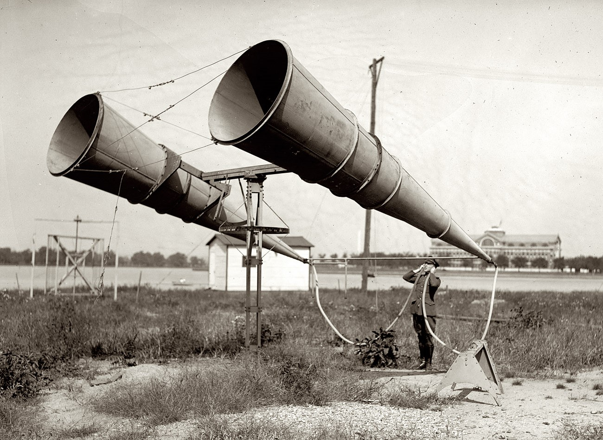
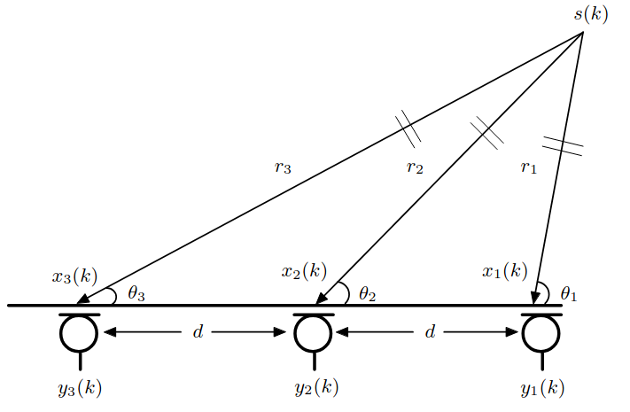

# Estimación de dirección de arribo de fuentes sonoras

## Perspectiva histórica

Imagínense que son franceses combatiendo en la primera guerra mundial. El Archiduque Ferdinando fue asesinado, intensificando el desequilibrio entre las relaciones diplomáticas de las grandes potencias de la época: los imperios Austro-Húngaro, Alemán, Británico y Ruso, además de Francia. En el medio de la feroz guerra de trincheras había surgido una nueva amenaza para la supervivencia, el ataque aéreo por parte de los zeppelines alemanes. En una situación así solo cabía razonar qué herramientas había disponibles para poder predecir de dónde podía provenir el siguiente ataque. Esperar a una identificación visual de la amenaza no era una opción válida, sería demasiado tarde. La alternativa que quedaba tenía que ver con otro de nuestros sentidos, la audición. Si estuviéramos en una habitación con los ojos cerrados y alguien hablara podríamos intuir de dónde viene la fuente a partir de las diferencias espectrales y de tiempo de arribo de la señal sonora a cada una de nuestros oídos. Extrapolando de forma algo irresponsable uno podría pensar que si puedo identificar la dirección de arribo de una fuente "chica" con sensores "chicos", podría lograr algo análogo para una fuente de porte mucho mayor usando sensores más grandes. Efectivamente es lo que pasó, llegando a sistemas como el que se ven a continuación:

El desarrollo de este campo de estudio no se detuvo aquí, y a lo largo de los años surgieron varios algoritmos que permiten determinar de forma precisa localizaciones espaciales de fuentes a partir de un número reducido de sensores (bastante) más convencionales que los mencionados anteriormente. 

## El TP

Las técnicas de estimación de arribo apuntan a, justamente, estimar la dirección de arribo de la señal sonora a los distintos sensores. Esto es sutilmente distinto a estimar la localización de la fuente, en donde buscamos determinar de forma precisa la posición (x,y,z) de la fuente en el espacio. Si la fuente sonora está localizada en el campo cercano, además de la dirección de arribo será posible determinar la distancia entre esta y los sensores. Esto es lo que buscaremos en este trabajo práctico, en donde estimaremos el ángulo azimutal de la fuente en cuestión y su distancia a los distintos sensores. Suponiendo que contamos con, por ejemplo, 3 micrófonos equiespaciados, el experimento queda representado por el siguiente diagrama:

en donde $s(t)$ representa la fuente cuya dirección se busca estimar en función del tiempo, $y_n(t)$ es la señal grabada por el enésimo sensor, $r_n$ la distancia entre la fuente y el sensor $n$, $\phi_n$ es el ángulo incidente y $d$ es la distancia entre micrófonos.

Obviamente, las distancias y los ángulos entre los sensores y la fuente son desconocidos, sino no habría mucho que discutir. Como casi siempre, hay una solución para este problema. Si conocemos las diferencias en los tiempos de arribo (TDOA, por las siglas en inglés) de las señales a cada micrófono, podemos estimar todas las variables que nos faltan. La TDOA entre los sensores 1 y 2 de nuestro ejemplo viene dada por:

$$ \tau_{1,2} = \frac{r_2-r_1}{c} $$

en donde $c$ corresponde a la velocidad de propagación del sonido en aire.

Por otro lado, la TDOA entre los sensores 1 y 3 es:

$$ \tau_{1,3} = \frac{r_3-r_1}{c} $$

Por otro lado, usando trigonometría sabemos que:

$$ r_2^2 = r_1^2 + d^2 + 2r_1\;\cos(\phi_1) $$

Análogamente:

$$ r_3^2 = r_1^2 + 4d^2 + 4r_1\;\cos(\phi_1) $$

Ahora bien, los sensores son colocados por el usuario, así que una vez que se define la geometría del arreglo de micrófonos $d$ es un dato medible. Si podemos estimar de alguna forma $\tau_{1,2}$ y $\tau_{1,3}$, usando las ecuaciones que acabamos de presentar podemos calcular las incógnitas $r_1$, $r_2$, $r_3$ y $\phi_1$. Aplicando nuevamente trigonometría podemos estimar $\phi_2$ y $\phi_3$, y, como se imaginarán este esquema de trabajo es extrapolable a un número arbitrario de sensores. Todo es calculable si conocemos, o estimamos, los TDOA. Es en este punto en donde nos vamos a centrar en el trabajo práctico.

La propuesta es que estimen las diferencias en tiempos de arribo mediante distintas técnicas: correlación cruzada clásica y su versión generalizada (con las distintas variantes que recaen dentro de esta versión). Como referencias, recomendamos el capítulo 9 de [1] y el trabajo de Knapp y CLifford [2], pero pueden extender esto si lo consideran pertinente. El array de sensores que deben proponer es de 4 micrófonos dispuestos linealmente con una separación de 10 cm entre ellos.

La implementación de los algoritmos propuestos es muy sencilla, por lo que la parte más interesante del trabajo recaerá en el análsis que hagan de los resultados que obtengan. Algunas preguntas interesantes que deberían hacerse son:

  -  ¿Da lo mismo usar un micrófono solo o un arreglo?
  -  ¿Es lo mismo hacer el experimento en una sala anecoica que en una normal? ¿Qué parámetros acústicos sería interesante estudiar en este último caso?
  -  ¿Hay diferencias en cuanto a tiempo de cómputo entre trabajar con la correlación cruzada en el dominio temporal y usar la versión generalizada de la correlacion cruzada?
  -  ¿En qué tipo de sistemas de coordenadas conviene trabajar, cartesianas, esféricas?

En cuanto a la evaluación de los algoritmos, deberían tener en cuenta los siguientes aspectos:

  -  Error en función del ángulo de elevación de la fuente.
  -  Error en función de la distancia entre la fuente y los sensores.
  -  Error en función de la separación entre micrófonos.
  -  Error en función de la cantidad de micrófonos del arreglo.
  -  Error en función de parámetros acústicos del recinto real.
  -  Error en función de parámetros elegidos al hacer la medición, como la frecuencia de muestreo.
  -  Otros tipos de análsis que se les ocurran.

En líneas generales, el desarrollo del trabajo tiene tres etapas:
  -  Simulación de recintos, arrays de micrófonos y fuente con pyroomacoustics, EASE, o el software que prefieran. Acá se deberían contemplar variaciones de los parámetros que les permitirán evaluar sus algoritmos sobre las distintas situaciones propuestas.
  -  Desarrollo de los algoritmos de TDAO y DAO.
  -  Evaluación de los algoritmos sobre las simulaciones generadas.

El desarrollo de su trabajo tiene que verse reflejado en un informe que siga el formato propuesto (en [Word](https://docs.google.com/document/d/1XwUWKWTRPKlJPzpGfd20riz-uNmUvYBx/edit?usp=drive_link&ouid=109118869525257004528&rtpof=true&sd=true) o en [LaTex](https://drive.google.com/file/d/12xZTOi8-OQKFwEuPdAjPenD1G1w3OghP/view?usp=drive_link)), cumpliendo con todas las secciones que en él se detallan. 

## Condiciones para la entrega

El trabajo puede realizarse en grupos de hasta 4 personas. Además de la entrega del trabajo completo se les pide una pre-entrega, que corresponde a una versión parcial del trabajo (secciones de Introducción, Marco teórico y Desarrollo experimental). También deben entregar el código correspondiente a las simulaciones acústicas y a los algoritmos de estimación de DOA y TDOA.

La fecha de la pre-entrega es el **11 de junio**, mientras que la fecha de la entrega final es el **30 de junio**. No se aceptarán entregas finales fuera de esta fecha (recuerden que el trabajo práctico es condición de aprobación de la cursada)

## Referencias

[1] Microphone Array Signal Processing. (2008). En Springer Topics in Signal Processing. Springer Berlin Heidelberg. https://doi.org/10.1007/978-3-540-78612-2 [LINK](https://drive.google.com/file/d/1zdFp_y5iELllENNXtSrRlrsap6-taXVE/view?usp=sharing)

[2] Knapp, C., & Carter, G. (1976). The generalized correlation method for estimation of time delay. IEEE Transactions on Acoustics, Speech, and Signal Processing, 24(4), 320–327. https://doi.org/10.1109/tassp.1976.1162830 [LINK](https://drive.google.com/file/d/1Y8QgWWNszJjTPhN6HyyN7iHceYvJpyRc/view?usp=sharing)
